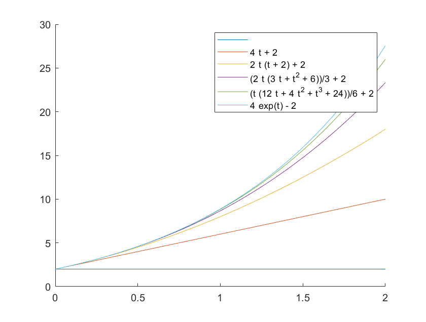

# 21261 selected matlab visualization
Selected matlab codes to give visualizations of some ODEs in 21261, Introduction to Ordinary Differential Equations. 
 
I hope this repo contains most MATLAB commands a typical undergraduate ODE course will need to use for visualization. This should help students to understand the behaviors of ODE at a glance and give a head start with Matlab.
 
 

# Week1 discussion: 

Equation: y'=y^3-y. Plot curves from some points:

# Homework1 Plot: 

 
# Week4 discussion:

Visualize solutions of x'(t) = x(1-x) - h * (1+sin(2*pi*t)) with different h values and initial data x_0

Visualize solutions of the system: x'=-y; y'=x 

# Homework6 Plot: 
Plot  the  first  few  terms  of  the  Picard  iteration  and the exact solution for  the  following  initial  value problems, as a visual illustration that Picard Iteration works. 
 
(a) x'= x + 2,   x(0) = 2.
 
(b) x'= x^(4/3), x(0) = 1.
 
(c) x'= cosx,    x(0) = 0.

# Week7 discussion:
Visualize solutions of x'' + b*x' + k*x = cos(omega*t)

By writing the ODE with a system of first order ODE,

x' = 0*x + 1*x';x''= -k*x - b*x' + cos(omega*t)

# Homework 8 P4
Sketch phase portrait for the following system:

x'=x^2−2xy;y'=y^2−2xy.

# Midterm exam problem 1 illustration
Problem statement: 
 

 
Visualization for different values of a:

